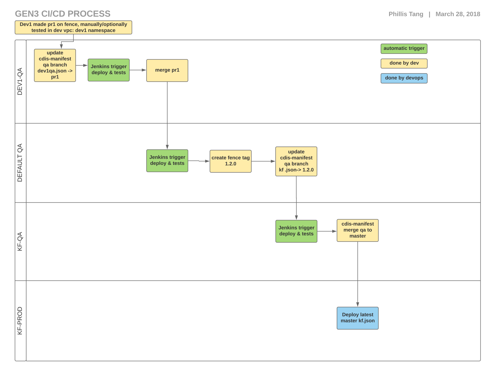

### Pre-commit hook installation:

`ln -s $(pwd)/.githooks/pre-commit $(pwd)/.git/hooks/pre-commit`

# TL;DR

Centrally manage and log configuration including which versions of which services get deployed where.  Ex:

```
$ cat dev.planx-pla.net/manifest.json 
{
  "notes": [
    "This is the dev environment manifest",
    "That's all I have to say"
  ],
  "jenkins": {
    "autodeploy": "yes"
  },
  "versions": {
    "fence": "quay.io/cdis/fence:2.4.0",
    "peregrine": "quay.io/cdis/peregrine:1.0.2",
    "sheepdog": "quay.io/cdis/sheepdog:1.1.2",
    "portal": "quay.io/cdis/data-portal:2.0.1",
    "fluentd": "fluent/fluentd-kubernetes-daemonset:v1.2-debian-cloudwatch",
    "jupyterhub": "quay.io/occ_data/jupyterhub:master"
  }
  "jupyterhub": {
    "enabled": "yes"
  }
}

```

## Policies

* Never release :master or :latest docker tags to production.
* `{DOMAIN}/manifest.json` is the manifest for a particular commons - ex: `manifest_dev.planx-pla.net_.json` 
* `default/manifest.json` is the fall-through default manifest if `{DOMAIN}/manifest.json` does not exist

## Deployment workflow



We run a *dev* kubernetes cluster and a *qa* cluster.  The dev cluster allows each developer to run her own
gen3 stack in its own namespace.  A developer can manipulate
the cluster directly (with `kubectl`) from the cluster's admin vm:
```
$ ssh reuben@k8s.devplanetv1
$ kubectl get pods
```

The *qa* cluster is administered by a [Jenkins](https://jenkins.io/) server at https://jenkins.planx-pla.net/, and is not directly accessible by `kubectl`.  Jenkins jobs 
monitor the QA branch of the [cdis-manifest](https://github.com/uc-cdis/cdis-manifest)
github repository, and auto-updates the gen3 qa environments running
on the cluster.  Jenkins also periodically runs gen3's system level integration tests against each QA environment.  We run one QA environment per production commons (https://kidsfirstqa.planx-pla.net, https://bloodpacqa.planx-pla.net, ...).  Each QA environment is
configured (via its manifest) to run the latest `:master` Docker image of each gen3 service. 

We also run one QA environment per developer (https://reubenqa.planx-pla.net, https://phillisqa.planx-pla.net, ...), 
so a developer
can test new code in the QA environment before merging the code into 
the `master` branch.

To update a QA environment such as *reubenqa.planx-pla.net*

* checkout the `QA` branch
* update `reubenqa.planx-pla.net/manifest.json` and push to github
* the Jenkins server running in the QA k8s cluster auto-deploys the new manifest - the QA environment's Jenkins server pulls manifests from the `QA` git branch

To update a production environment such as *data.bloodpac.org*

* first - tag each service with a [semver](https://semver.org) version -
    we only deploy version-tagged images to production (not `:latest` or `:master`)
* checkout the `QA` branch of the [cdis-manifest](https://github.com/uc-cdis/cdis-manifest) repo
* update `data.bloodpac.org/manifest.json` and push to github
* submit a pull request (PR)
* after the PR is approved and merged, then kickoff a deployment script (details TBD) - production deployment automation pulls manifests from the `master` git branch
* run gen3's integration test suite against the new production deployment (this happens automatically)

Note that the Google Data Access integration tests are NOT ran when changes are made to environments that do not use Google Data Access features. The list of environments that do run these tests can be updated in [this file](https://github.com/uc-cdis/gen3-qa/blob/master/run-tests.sh).

## Automation

We implement manifest based versioning of our services in kubernetes via the `gen3` helper scripts in [cloud-automation](https://github.com/uc-cdis/cloud-automation).  The `-deployment.yaml` template defining each service's k8s deployment includes `GEN3` variables that `gen3 roll` replaces.  For example:
```
$ cat cloud-automation/kube/services/peregrine/peregrine-deploy.yaml 
apiVersion: extensions/v1beta1
kind: Deployment
metadata:
  name: peregrine-deployment
spec:
  revisionHistoryLimit: 2
  strategy:
    type: RollingUpdate
    rollingUpdate:
      maxSurge: 1
      maxUnavailable: 0
  template:
    metadata:
      labels:
        app: peregrine
        GEN3_DATE_LABEL
    spec:
      automountServiceAccountToken: false
      ...
      containers:
        - name: peregrine
          GEN3_PEREGRINE_IMAGE
          livenessProbe:
            httpGet:

$ gen3 roll peregrine
...
```

## Release notes

* [fence](https://github.com/uc-cdis/fence/releases)
* [peregrine](https://github.com/uc-cdis/peregrine/releases)
* [portal](https://github.com/uc-cdis/data-portal/releases)
* [sheepdog](https://github.com/uc-cdis/sheepdog/releases)


